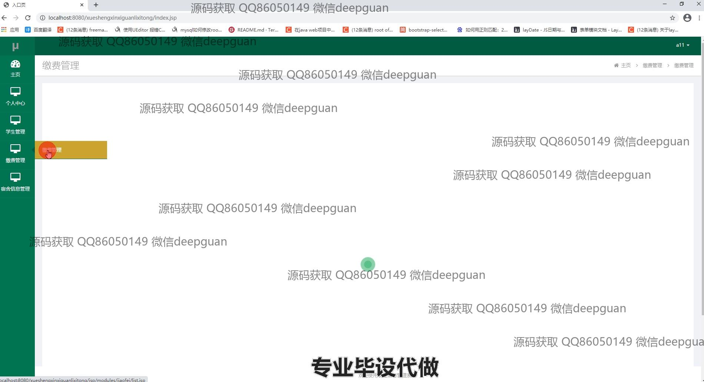
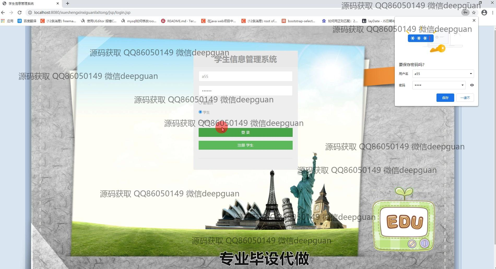

<h1 align="center">基于Java的学生信息管理系统的设计与实现</h1>

## 简介
学生信息管理系统：角色分为管理员、学生、教师；功能包括登录注册、宿舍管理、学生管理、缴费管理、教师管理、密码修改与综合信息查询。    --计算机毕业设计源码；毕设源码；java毕业设计源码

## 联系方式

<h3 align="center">获取完整代码与数据库文件 + 微信：deepguan QQ: 86050149 QQ群: 783742310</h3>

<h3 align="center">可帮忙远程部署 包运行成功！提供远程部署、修改代码、设计文档指导、代码讲解等服务！</h3>

## 功能介绍（完整见运行截图）
管理员：登录、注册、退出；管理学生信息，包括新增、修改、删除和查询；管理教师信息，包括基本信息编辑和查询；管理宿舍信息，支持宿舍楼栋、单元、房间号的添加、查询、批量删除和负责人信息管理；缴费管理，包括缴费类型添加、修改、删除和学生缴费记录查看、查询；密码管理，支持密码修改。

教师：登录、退出；管理学生信息，支持查看和编辑学生的基本信息；管理宿舍信息，支持宿舍分配和修改；查看学生的缴费记录和状态；个人信息管理，支持信息查看与修改；提交与审核学生成绩及奖惩记录。

学生：登录、注册、退出；查看个人基本信息和宿舍信息；查看与缴纳费用，支持缴费记录查询；管理个人密码，支持修改；参与奖惩记录管理，支持查看相关奖惩记录；提交个人信息修改请求，等待审核。

访客：支持学生账号注册功能；浏览系统登录界面和部分通用信息；了解系统的主要功能模块和使用指引；无法操作管理功能，仅限于基础交互。

## 运行截图

本代码来源于网络,仅供学习参考使用!

